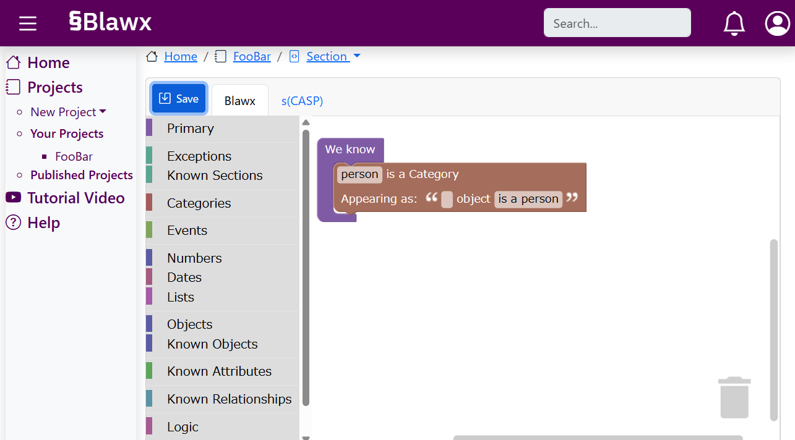
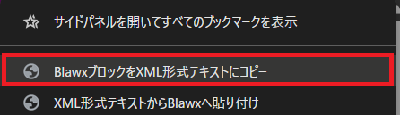
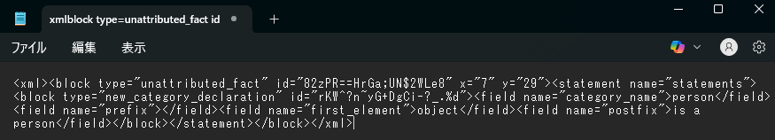
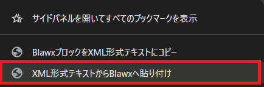
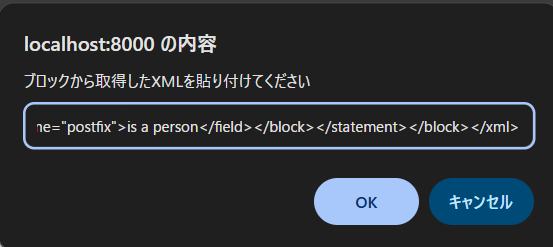

# blawx_bookmarklet

Blawx開発を補助するブックマークレット

Bookmarklets to support Blawx development (unofficial)

# About / 概要

（TODO: insert gif）

BlawxのコードブロックをXML形式でコピー、貼り付けできるブックマークレットです。以下の用途等にご活用ください。

- ブロックを別プロジェクトへコピー
    - 現在開いている画面のブロックのみコピーが可能
- XML形式のテキストをAIへのプロンプトに使用
    - LLMはブロックのスクリーンショットよりもXML形式のテキストの方が解釈しやすい

This is a list of bookmarkets which can copy and paste Blawx code blocks as XML format text. You can use them for developments below etc.

- Copy blocks to another project
    - able to copy blocks only shown in the current window
- Use XML text for AI prompt
    - it is easier for LLM to interpret XML text than block screenshot images

# Disclaimer / おことわり

本ブックマークレットは非公式です。今後Blawx本体のアップデートにより動作しなくなる可能性があります。

This bookmarklet is unofficial. It may not work in the future due to Blawx updates.

# Setup / 準備

以下のJavaScriptコードをブックマーク（ブックマークレット）のURLとして登録してください。

Please register these JavaScript snippets below as bookmarklet URLs.

## Copy Blawx Blocks to the Clipboard as XML Text / BlawxブロックをXML形式テキストにコピー

```js
javascript:setTimeout(()=>navigator.clipboard.writeText(Blockly.Xml.workspaceToDom(demoWorkspace).outerHTML),100)
```

## Paste XML text to Blawx blocks / XML形式テキストからBlawxへ貼り付け

```js
javascript:Blockly.Xml.domToWorkspace(Blockly.utils.xml.textToDom(prompt('ブロックから取得したXMLを貼り付けてください')),demoWorkspace);
```

## How to Create Bookmarklets / ブックマークレットの作り方

### Chrome

登録方法
- 1. `Ctrl + Shift + O` 同時押しでブックマークマネージャを開く
- 2. 右上の三点リーダ `︙` をクリック、`新しいブックマークを追加` を選択
- 3. `名前` に分かりやすい名前（例: `BlawxブロックをXML形式テキストにコピー`）、`URL` に上記のJavaScriptコードを指定し保存
    - `https://` から始まっていませんがURL欄に登録可能です

　
How to register
- 1. Open bookmark manager by pressing `Ctrl + Shift + O`
- 2. Click upper right `︙` then select `add new bookmark`
- 3. Set description to `name` and the JavaScript snippet above to `URL`
    - It does not start with `https://`, but can be entered in the URL field.

### Edge

登録方法
- 1. `Ctrl + Shift + O` 同時押しでお気に入りを開く
- 2. 表示された `お気に入り` という文字をクリックしお気に入りページを開く
- 3. 上部 `お気に入りを追加` を選択
- 4. `名前` に分かりやすい名前（例: `BlawxブロックをXML形式テキストにコピー`）、`URL` に上記のJavaScriptコードを指定し保存
    - `https://` から始まっていませんがURL欄に登録可能です

How to register
- 1. Open favorites by pressing `Ctrl + Shift + O`
- 2. Click text `Favorites` to open the favorite page
- 3. Select `Add favorite` at the top
- 4. Set description to `name` and the JavaScript snippet above to `URL`
    - It does not start with `https://`, but can be entered in the URL field.

### Firefox

登録方法
- 1. `Ctrl + Shift + O` 同時押しでブラウジングライブラリーを開く
- 2. 左上 `管理` を選択し、`新しいブックマークを追加` を選択
- 3. `名前` に分かりやすい名前（例: `BlawxブロックをXML形式テキストにコピー`）、`URL` に上記のJavaScriptコードを指定し保存
    - `https://` から始まっていませんがURL欄に登録可能です
    - `タグ` と `キーワード` は空欄で構いません

- 1. Open browsing library by pressing `Ctrl + Shift + O`
- 2. Select upper left `Organize` and then select `new bookmark`
- 3. Set description to `name` and the JavaScript snippet above to `URL`
    - It does not start with `https://`, but can be entered in the URL field.
    - `tag` and `keyword` can be empty

# Usage / 使い方

## Copy Blawx Blocks to the Clipboard as XML Text / BlawxブロックをXML形式テキストにコピー

Blawxの`Code Editor`を開き、コピーしたいブロックを表示させます。

Open `Code Editor` in Blawx and show blocks you wants copy.



作成したブックマークレットを開きます。**Blawxのページから移動しませんが問題ありません（想定通りです）**

Open the bookmarklet you made. **You will stay at Blawx page, but that's not a proplem (it is expected).**




メモ帳などを開き `貼り付け` を行うと、ブロックがXML形式のテキストで取得できます。

Open editors such as notepad and `paste` into it, then you can get the blocks as XML formatted text.



## Paste XML text to Blawx blocks / XML形式テキストからBlawxへ貼り付け

作成したブックマークレットを開きます。**Blawxのページから移動しませんが問題ありません（想定通りです）**

Open the bookmarklet you made. **You will stay at Blawx page, but that's not a proplem (it is expected).**



表示されたプロンプトに、`BlawxブロックをXML形式テキストにコピー` で取得したXML形式のテキストを貼り付け、`ok` を選択します。

Paste the XML formatted text obtained from `Copy Blawx Blocks to the Clipboard as XML Text` into the prompt, then select `ok`.



ブロックが挿入されます。

Specified blocks are inserted.


# How it works / 動作原理

See [How It Works](./how_it_works.md)
